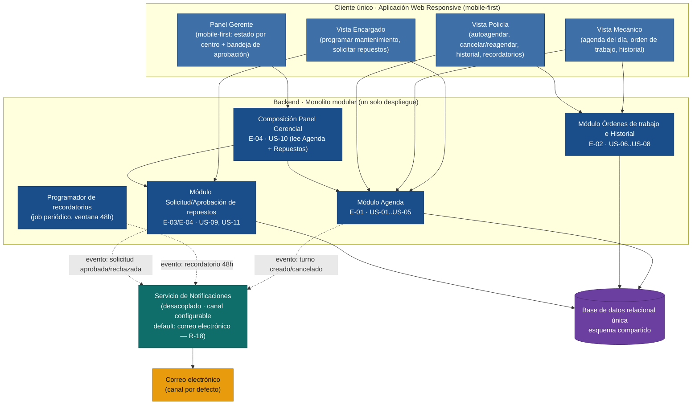

# Arquitectura — Gestión Vehicular Policial (MVP)

Fuente única: `inbox/mvp-canvas.md`, `inbox/requisitos.md`, `inbox/personas.md`,
`inbox/user-stories.md`, `inbox/evidence-map.json`, `outputs/epics.md`,
`outputs/backlog.json`, `outputs/stories.md`. Toda decisión aquí cita su fuerza
exacta de origen; nada está inventado fuera de esas fuentes.

## Principio rector

El MVP tiene 42 puntos, 11 historias y una métrica de éxito medida "sobre el
primer mes de uso en **al menos un centro piloto**" (`mvp-canvas.md`). No hay
evidencia en el discovery de múltiples centros simultáneos, alta concurrencia,
ni necesidad de integración con sistemas externos. La arquitectura elegida es,
por tanto, **la más simple que sostiene el valor de las 4 épicas sin cerrar la
puerta a crecer después**: un frontend web único responsive y un backend
monolítico modular sobre una base de datos relacional única, con un servicio de
notificaciones desacoplado internamente. Cada decisión relevante se documenta
en un ADR (`adr/ADR-NNNN-*.md`); lo que el MVP todavía no necesita se declara al
final como decisión diferida, no como ADR aceptado.

---

## Diagrama de componentes

---

## Justificación de valor / simplicidad por componente

### Cliente único responsive (no apps nativas separadas)
Sostiene el outcome de las 4 épicas a la vez con un solo esfuerzo de
construcción. El riesgo **S-2 · ALTO** ("el mecánico, sin estudios superiores
y con muchos años en el proceso manual, podrá registrar órdenes en la interfaz
digital sin capacitación extensa", `mvp-canvas.md`) exige una interfaz simple,
no necesariamente una app nativa; y **R-17** exige que la vista del gerente
funcione en el celular. Un único frontend responsive resuelve ambas fuerzas sin
duplicar código: la misma base de componentes se adapta a pantalla de taller
(encargado/mecánico) y a celular (gerente/policía). Ver `ADR-0001`.

### Módulo Agenda (E-01)
Es el componente que sostiene el outcome que la métrica de éxito del MVP mide
directamente ("tasa de cumplimiento de mantenimientos programados ≥ 70 %",
`mvp-canvas.md`) y el que concentra el riesgo más alto de adopción, **S-1 ·
ALTO** ("los policías adoptarán el sistema... igual que ignoraban el papel").
Por eso es el módulo con más historias (US-01 a US-05, 18 pts) y el primero en
integrarse con notificaciones: sin recordatorio confiable, el riesgo S-1 se
materializa.

### Módulo Órdenes de trabajo e Historial (E-02)
Ataca el dolor con consecuencia institucional documentada: "el registro de
materiales y costos se lleva en Excel... ha habido errores de suma con
consecuencias para la institución" (`mecanico.md`, `epics.md` E-02). Por eso
vive en el mismo backend que Agenda y comparte la misma base de datos: el
cálculo de costo total (US-06) y el historial consultado por mecánico y
policía (US-07, US-08) necesitan las mismas entidades (vehículo, mantenimiento)
sin traducción entre sistemas.

### Módulo Solicitud/Aprobación de repuestos (E-03) y Panel Gerencial (E-04)
El panel (US-10) no es un componente nuevo de datos: es una **composición de
lectura** sobre Agenda (estado de mantenimientos) y Repuestos (bandeja de
aprobación), tal como lo describe `epics.md` ("depende de que existan
solicitudes de repuestos [E-03] y estados de mantenimiento [E-01/E-02] para
tener contenido real que mostrar"). Construirlo como un módulo aparte que solo
lee de los otros dos, en vez de una base de datos o servicio propio, evita
duplicar el estado de "pendiente/aprobado/rechazado" en dos lugares.

### Servicio de Notificaciones (desacoplado)
Cinco historias distintas (US-01, US-02, US-03, US-04, US-09, US-11) disparan
notificaciones y R-18 deja el canal explícitamente configurable ("correo
electrónico u otro canal digital configurado"). Desacoplarlo evita que cada
módulo reimplemente el envío y permite cambiar el canal por defecto sin tocar
la lógica de agenda, órdenes o repuestos. Ver `ADR-0002`.

### Base de datos relacional única
Las entidades del dominio (vehículo, mantenimiento, orden de trabajo, ítem de
repuesto, solicitud) tienen relaciones fuertes y se consultan de forma cruzada
constantemente (el panel gerencial cruza agenda + repuestos; el historial
cruza vehículo + órdenes). No hay evidencia en el discovery de volumen o
escala que justifique otra cosa. Ver `ADR-0004`.

---

## ADRs de esta arquitectura

| ADR | Decisión | Fuerza que la motiva |
|---|---|---|
| [ADR-0001](adr/ADR-0001-frontend-web-responsive-unico.md) | Frontend web único responsive (mobile-first), sin apps nativas separadas | R-17, riesgo S-2 (ALTO), pain `gerente#reportes-excel-celular` |
| [ADR-0002](adr/ADR-0002-servicio-notificaciones-desacoplado.md) | Servicio de notificaciones desacoplado, correo electrónico como canal por defecto | R-18, riesgo S-1 (ALTO), US-01/US-03/US-04/US-09/US-11 |
| [ADR-0003](adr/ADR-0003-monolito-modular.md) | Monolito modular (no microservicios) para Agenda/Órdenes/Repuestos/Panel | Tamaño del MVP (42 pts, `backlog.json`), métrica "al menos un centro piloto" (`mvp-canvas.md`) |
| [ADR-0004](adr/ADR-0004-persistencia-relacional-unica.md) | Persistencia relacional única y compartida | R-01/US-06 (integridad del cálculo de costos), ausencia de evidencia de escala |

---

## Supuestos abiertos (no bloquean el diseño, pero no están evidenciados)

- **Número de centros del piloto:** `mvp-canvas.md` dice "al menos un centro
  piloto" sin precisar cuántos centros tiene la institución en total. El
  modelo de datos ya contempla "centro" como atributo filtrable (R-15, US-10),
  suficiente para 1 o varios centros sin cambiar la arquitectura; el número
  exacto no cambia ninguna decisión de este documento.
- **Infraestructura de correo institucional:** R-18 no especifica si la
  institución ya tiene un servidor SMTP propio o si se debe usar un proveedor
  externo. `ADR-0002` fija el canal (correo) pero no el proveedor concreto:
  detalle de implementación a resolver por el equipo de construcción, no de
  arquitectura.

---

## Decisiones diferidas (aún no necesarias)

Estas decisiones **no** se documentan como ADR aceptado porque el MVP, tal
como está evidenciado en el discovery y acotado en `epics.md`/`backlog.json`,
todavía no las necesita. Forzarlas ahora sería sobre-diseño.

- **Escalamiento multi-centro más allá del piloto.** La métrica de éxito del
  MVP se mide "sobre el primer mes de uso en al menos un centro piloto"
  (`mvp-canvas.md`); no hay evidencia de cuántos centros existen en total ni de
  requisitos de particionamiento de datos entre ellos. Se difiere cualquier
  decisión de sharding, multi-tenencia estricta o despliegues independientes
  por centro hasta que exista esa evidencia.
- **Arquitectura de microservicios / escalamiento horizontal.** Evaluada y
  descartada para el tamaño actual en `ADR-0003`; se revisará solo si aparece
  evidencia real de carga o de equipos que necesiten desplegar módulos de
  forma independiente.
- **Integración con sistemas externos (contable/nómina).** `personas.md`
  menciona un stakeholder "Departamento administrativo/contable" con interés
  en recibir reportes, pero es un interés **inferido** ("no existe entrevista
  directa de este actor") y ninguna épica ni historia del backlog actual
  requiere una integración de sistemas. No se diseña ninguna interfaz de
  integración todavía.
- **Canales de notificación adicionales (SMS, push).** R-18 permite "otro
  canal digital configurado", pero ninguna historia del backlog exige
  construirlo ya. `ADR-0002` deja la interfaz de notificación diseñada para
  ser extensible, pero el MVP solo implementa el canal por defecto (correo).
- **Módulos fuera de alcance del MVP** (inventario de bodega R-07/R-08,
  autorización de viajes R-11, traspasos con fotos R-12, novedades
  multimedia R-13, reportes avanzados automáticos R-14): `mvp-canvas.md` ya
  los declara explícitamente fuera de alcance para la iteración 2. No se
  reserva infraestructura para ellos ahora (p. ej. almacenamiento de archivos
  multimedia para R-12/R-13); cuando se retomen requerirán sus propios ADRs.
- **Autenticación/identidad institucional (SSO, Active Directory policial).**
  Ningún documento del inbox menciona un mecanismo de autenticación existente
  en la institución. Se difiere el diseño de integración de identidad; el MVP
  puede operar con un mecanismo de autenticación propio simple, a definir por
  el equipo de construcción sin que esto condicione la arquitectura descrita
  aquí.
