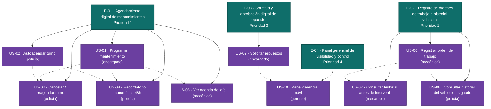

# Épicas — Gestión Vehicular Policial (MVP)

Fuente única: `inbox/mvp-canvas.md`, `inbox/user-stories.md`, `inbox/requisitos.md`,
`inbox/personas.md`, `inbox/evidence-map.json`. Toda épica e historia cita su
`origin` exacto en `backlog.json`; nada aquí está inventado fuera del inbox.

El MVP Canvas define tres outcomes encadenados a un mismo impacto ("menos
vehículos con mantenimiento atrasado; menos reparaciones correctivas evitables;
trazabilidad de recursos públicos"):

1. Los policías asisten en fecha.
2. Los mecánicos registran sin errores.
3. El gerente aprueba sin revisar correos.

Las cuatro épicas siguientes descomponen esos tres outcomes en resultados de
comportamiento verificables, agrupando las 10 historias candidatas de
`user-stories.md` tal como ya venían organizadas por outcome en el inbox (no por
módulo técnico).

---

## E-01 · Agendamiento digital de mantenimientos

**Valor (outcome):** El policía llega a su cita sin que el mecánico tenga que
llamarlo a reclamar; el encargado deja de coordinar por celular personal. Este
outcome es el que la métrica de éxito del MVP mide directamente.
**Origen:** `mvp-canvas.md` → funcionalidades mínimas 1 (agenda digital), 2
(cancelación/reagendamiento), 3 (recordatorio 48h); outcome "Los policías asisten
en fecha"; métrica de éxito "Tasa de cumplimiento de mantenimientos programados
≥ 70 %". `requisitos.md` → R-03, R-04, R-05.
**Prioridad:** 1 (más alta)
**Historias:** US-01, US-02, US-03, US-04, US-05

Justificación de valor: es el outcome que la métrica de éxito del MVP mide
explícitamente (tasa de cumplimiento ≥ 70 %) y concentra los dos riesgos más
altos del árbol de supuestos del discovery (S-1 "los policías adoptarán el
sistema", S-2 "el mecánico usará la interfaz sin fricción"). Sin agendamiento
confiable no hay órdenes que registrar ni historial que consultar — es la base
que habilita el resto del flujo.

---

## E-02 · Registro de órdenes de trabajo e historial vehicular

**Valor (outcome):** El mecánico cierra cada intervención en el sistema sin
riesgo de olvido ni error de suma, y cuenta con el historial del vehículo antes
de intervenir; el policía puede consultar si el vehículo que le asignan tiene
problemas recurrentes.
**Origen:** `mvp-canvas.md` → funcionalidades mínimas 4 (registro digital de
órdenes de trabajo), 5 (historial por vehículo); outcome "los mecánicos
registran sin errores"; impacto "menos reparaciones correctivas evitables".
`requisitos.md` → R-01, R-02, R-06.
**Prioridad:** 2
**Historias:** US-06, US-07, US-08

Justificación de valor: ataca directamente el dolor con consecuencia
institucional documentada ("ha habido errores de suma con consecuencias para
la institución", `mecanico.md`) y es el segundo outcome explícito del canvas.
Depende operativamente de que existan turnos agendados (E-01) para tener algo
que registrar, por eso va segunda y no primera.

---

## E-03 · Solicitud y aprobación digital de repuestos

**Valor (outcome):** El encargado envía la solicitud de repuestos y recibe una
respuesta formal en el sistema, sin tener que llamar para confirmar si el
gerente la vio.
**Origen:** `mvp-canvas.md` → funcionalidad mínima 6 (flujo digital de solicitud
y aprobación de repuestos); outcome "el gerente aprueba sin revisar correos".
`requisitos.md` → R-09.
**Prioridad:** 3
**Historias:** US-09

Justificación de valor: resuelve un dolor de riesgo institucional (repuestos
sin respuesta formal, `encargado.md`: "no siempre llega una respuesta formal...
obligando a llamar para confirmar") y es condición previa de datos para que el
panel gerencial (E-04) tenga algo que mostrar en su bandeja de aprobaciones.

---

## E-04 · Panel gerencial de visibilidad y control

**Valor (outcome):** El gerente revisa el estado de mantenimientos de sus
centros y aprueba solicitudes de repuestos desde el celular, sin depender de
Excel ni de llamadas de seguimiento del encargado.
**Origen:** `mvp-canvas.md` → funcionalidad mínima 7 (panel del gerente
mobile-friendly); outcome "el gerente aprueba sin revisar correos".
`requisitos.md` → R-10, R-15, R-17.
**Prioridad:** 4
**Historias:** US-10, US-11

Justificación de valor: es el outcome de menor riesgo del árbol de supuestos
del discovery (S-4 "BAJO": "el gerente preferirá el panel al correo si la
información es la misma") y, según `gerente.md`, los reportes en Excel "solo
los necesita a fin de mes" — es decir, la urgencia operativa es menor que la de
las tres épicas anteriores. Además depende de que existan solicitudes de
repuestos (E-03) y estados de mantenimiento (E-01/E-02) para tener contenido
real que mostrar.

---

## Preguntas abiertas a nivel de backlog

- El canal exacto de las notificaciones (agenda, reglas de cancelación, avisos
  de aprobación) no está cerrado: `requisitos.md` (R-18) lo describe como
  "correo electrónico u otro canal digital configurado", y `user-stories.md`
  (US-04) lo deja igual de abierto ("canal configurado (correo u otro)"). Ver
  `open_questions` de US-04 en `backlog.json`.
- El alcance exacto de "acumulado de costos del período" en el panel gerencial
  (US-10) no está definido con precisión frente a R-14 ("Reportes avanzados
  automáticos"), que el propio `mvp-canvas.md` declara fuera de alcance del
  MVP. Ver `open_questions` de US-10 en `backlog.json`.

---

## Diagrama del backlog (épicas → historias)

> Nota: las flechas punteadas indican dependencia de datos entre historias
> (declaradas en `dependencies` de `backlog.json`), no jerarquía épica→historia.
